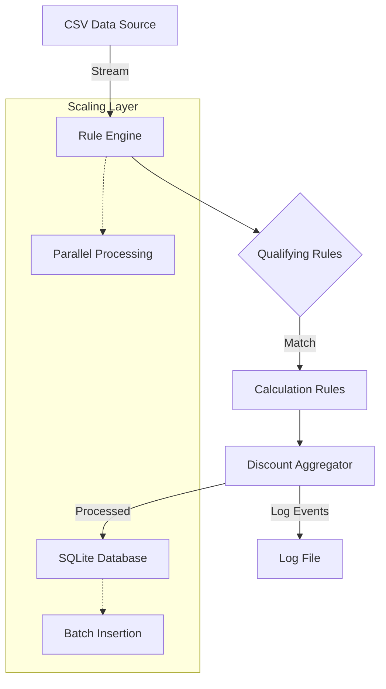
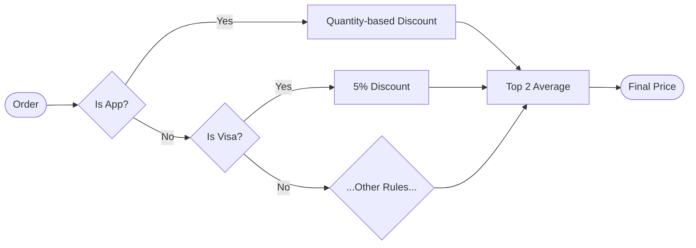

# Scala Rules Engine

A high-performance, functional rule engine built in Scala for a large retail store. The engine qualifies order transactions against a set of business rules, automatically calculates discounts, computes final prices, and persists results to a database — all while processing **10 million orders per batch** with flat memory usage.
 
Built strictly following functional programming principles: **no vars, no loops, no mutable structures, pure functions only.**

## 🎯 Business Requirements
 
| Requirement | Details |
|---|---|
| Qualifying rules | Multiple rules that determine if an order gets a discount |
| Calculation rules | Each qualifying rule has its own discount formula |
| Multiple discounts | If order qualifies for 2+ rules → average of **top 2** discounts |
| No discount | Orders that don't qualify → **0% discount** |
| Final price | `unitPrice × quantity × (1 - discount)` |
| Persistence | Store results in a database |
| Logging | Log all engine events to `rules_engine.log` |
 
---
 
## 📋 Discount Rules
 
### Qualifying + Calculation Rules
 
| # | Rule | Qualifier | Discount |
|---|---|---|---|
| 1 | Product expiring soon | Less than 30 days to expiry | `(30 - daysRemaining) / 100` e.g. 29 days → 1%, 1 day → 29% |
| 2 | Cheese or Wine | Product name contains "cheese" or "wine" | Cheese → 10%, Wine → 5% |
| 3 | March 23rd sale | Transaction date is March 23rd | 50% |
| 4 | Bulk order | Quantity > 5 | 6-9 → 5%, 10-14 → 7%, 15+ → 10% |
| 5 | App channel | Sold through App | `ceil(quantity / 5) × 5%` |
| 6 | Visa payment | Paid with Visa card | 5% |


## ⚡ Scaling — 10 Million Orders
 
The engine handles 10M+ orders per batch using 3 techniques:
 
### 1. Lazy Iterator — Memory Efficiency
 
```scala
def readFile(fileName: String): Try[Iterator[String]] =
  Try(Source.fromFile(fileName).getLines())
```
 
```
Without Iterator:   10M lines → RAM → OutOfMemoryError 
With Iterator:      1 line → process → gone → next line 
```
 
### 2. Parallel Processing — CPU Efficiency
 
```scala
def processOrders(orders: Iterator[Order]): Iterator[ProcessedOrder] =
  orders
    .grouped(40000)
    .flatMap { chunk =>
      chunk.par
        .map(applyDiscount(getDiscountRules()))
        .toList
        .iterator
    }
```
 
```
Chunk of 40000 orders:
Core 1: orders 1     - 10000  ──┐
Core 2: orders 10001 - 20000  ──┤ → simultaneously
Core 3: orders 20001 - 30000  ──┤
Core 4: orders 30001 - 40000  ──┘
```
 
### 3. Batch DB Insert — I/O Efficiency
 
```scala
orders
  .grouped(40000)
  .map { chunk =>
    chunk.foreach { p => bindOrder(stmt, p); stmt.addBatch() }
    stmt.executeBatch()   // one disk hit per 40000 rows
    stmt.clearBatch()
  }
conn.commit()             // single transaction — all or nothing
```


## Architecture and Rule Flow Diagrams

### System Architecture


### Rule Evaluation Flow


## Technical Considerations

The project adheres to strict functional programming principles:

*   **Immutability**: Only `val`s are used; `var`s are not allowed.
*   **No Loops**: Iterative operations are performed using higher-order functions.
*   **Pure Functions**: Functions depend solely on their input, produce no side effects, and return a value for every possible input.
*   **Clean and Well-Commented Code**: Emphasis on readability and self-explanatory code.

## How to Run

## 🛠️ Setup & Run
 
### Prerequisites
 
- Scala 2.13+
- SBT
- Java 11+
### Dependencies — `build.sbt`
 
```scala
libraryDependencies ++= Seq(
  "org.xerial"             %  "sqlite-jdbc"                 % "3.43.0.0",
  "org.scala-lang.modules" %% "scala-parallel-collections"  % "1.0.4"
)
```
 
### Steps
 
```bash
# 1. clone
git clone https://github.com/Mirmed/retail-discount-engine-scala.git
cd retail-discount-engine-scala
 
# 2. place your CSV file
 
# 3. run
sbt run
```
 
### Output files
 
```
orders.db          ← processed results in SQLite
rules_engine.log   ← all engine events
```
